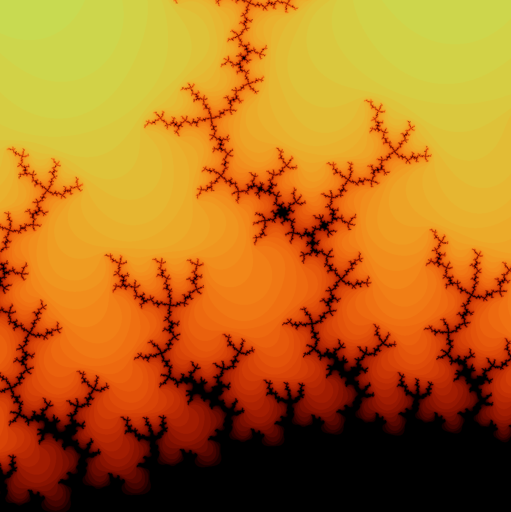
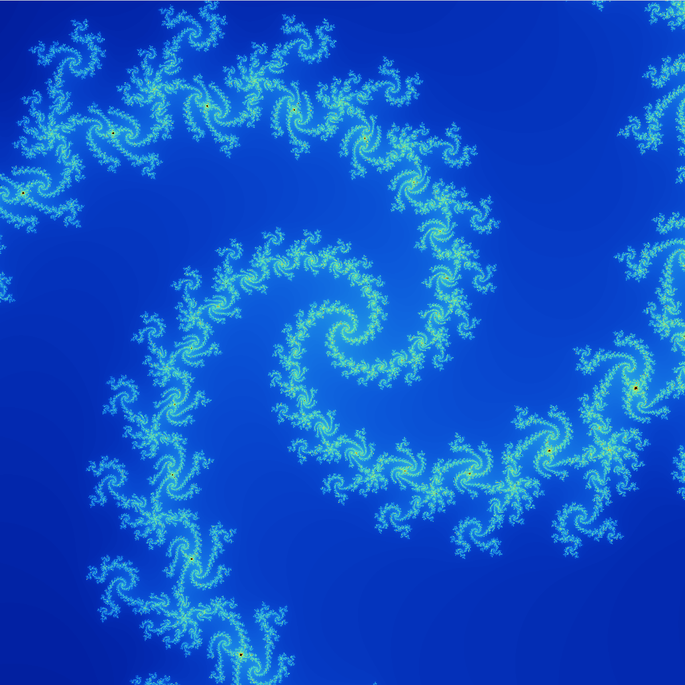

# HIP Accelerated Mandelbrot Set

This project is a visualizer for the Mandelbrot set, it lets you explore this famous mathematical fractal.

> **Note:** This project is based on the original work by Sol from [solarianprogrammer.com](http://www.solarianprogrammer.com). The original project can be found at: [http://solarianprogrammer.com/2013/02/28/mandelbroot-set-cpp-11/](http://solarianprogrammer.com/2013/02/28/mandelbroot-set-cpp-11/)

## Features

- Control over maximum iteration count
- Screenshots of the current view

## Prerequisites

- CMake (version 3.28.0 or higher)
- C++ compiler compatible with C++20
- SFML 2 (for graphical interface)
- FreeImage (for image saving)
- For GPU acceleration: HIP

## Installation

### Installing Dependencies

On linux like systems, you can install the required dependencies using your package manager.

```bash
sudo package_manager install build-essential cmake libsfml-dev libfreeimage-dev
```

For HIP acceleration (GPU cards):

```bash
# Follow the HIP SDK installation instructions for your distribution
# https://rocm.docs.amd.com/projects/HIP/en/latest/install/install.html
```

### Compilation

CMAKE is used to build the project. list of CMake Variables that can be set: 
- `ENABLE_HIP`: Enable HIP GPU acceleration (default: OFF)
- `ENABLE_OPENMP`: Enable OpenMP parallel processing (default: OFF)
- `ENABLE_SEQUENTIAL`: Enable sequential processing (default: ON)

```bash
mkdir build_mandelbrot
cmake -S . -B build_mandelbrot -DENABLE_HIP=ON -DENABLE_OPENMP=ON -DCMAKE_BUILD_TYPE=Release
cmake --build build_mandelbrot -j 4
```

### Controls

- **Navigation**: Use arrow keys to move around the fractal
- **Zoom**: Use `+` to zoom in and `-` to zoom out
- **Iterations**: Use `Page Up` to increase and `Page Down` to decrease maximum iterations
- **Save**: Press `S` to save an image of the current view

## Technical Implementation

The project is structured into several components:

- **Core**: Global configuration and basic utilities
- **Fractal**: Implementation of calculation algorithms (sequential, OpenMP, HIP)
- **SFML**: Management of graphical interface and events
- **Render**: Coloration and rendering of the fractal

## Examples

Here are some examples of images generated by this project:

<div style="display: flex; flex-direction: row; flex-wrap: nowrap; justify-content: space-between;">
   <div style="margin: auto;">
    
    
  </div>
</div>

## Future Development

- More Zoom levels
- Improved user interface
- OpenMP use
- Support for other fractal types (Julia...)
- More parameterization options for the fractal generation

## License

This project is based on work originally released under GPL v3 by Sol from [solarianprogrammer.com](http://www.solarianprogrammer.com) and is distributed under the same license. For more details see:
http://www.gnu.org/copyleft/gpl.html
